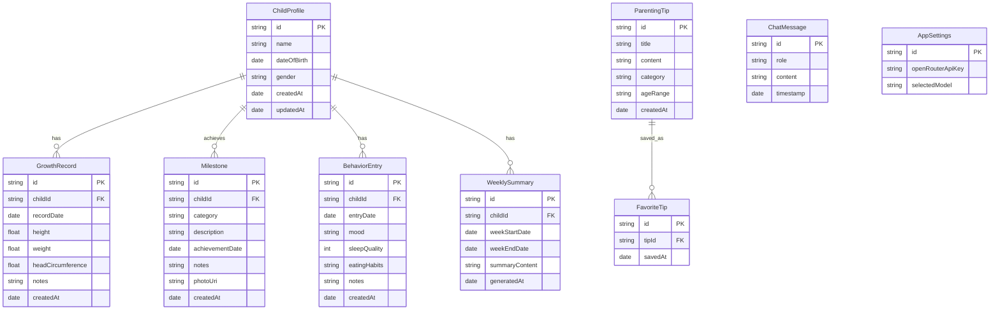

# Design Document

## Overview

The Child Growth Tracker is an Android mobile application built using modern Android development practices. The app follows a clean architecture pattern with clear separation between UI, business logic, and data layers. The design prioritizes simplicity, quick data entry, and offline-first functionality with all data stored locally on the device.

### Technology Stack

- **Platform**: Android (API Level 26+, Android 8.0 Oreo and above)
- **Language**: Kotlin
- **UI Framework**: Jetpack Compose for modern, declarative UI
- **Architecture**: MVVM (Model-View-ViewModel) with Clean Architecture principles
- **Database**: Room (SQLite) for local data persistence
- **Security**: Android Keystore for encryption
- **Charts**: MPAndroidChart or Vico for growth visualization
- **AI Integration**: OpenRouter API for AI chat and summary generation
- **HTTP Client**: Retrofit or Ktor for API communication
- **JSON Parsing**: Kotlinx Serialization or Gson

## Architecture

### High-Level Architecture

```
┌─────────────────────────────────────────────────┐
│              Presentation Layer                  │
│  (Jetpack Compose UI + ViewModels)              │
└─────────────────┬───────────────────────────────┘
                  │
┌─────────────────▼───────────────────────────────┐
│              Domain Layer                        │
│  (Use Cases + Business Logic + Entities)        │
└─────────────────┬───────────────────────────────┘
                  │
┌─────────────────▼───────────────────────────────┐
│              Data Layer                          │
│  (Repositories + Room Database + Data Sources)  │
└─────────────────────────────────────────────────┘
```

### Layer Responsibilities

**Presentation Layer**:
- Jetpack Compose screens and composables
- ViewModels managing UI state
- Navigation handling
- User input validation

**Domain Layer**:
- Use cases encapsulating business logic
- Domain models (entities)
- Repository interfaces

**Data Layer**:
- Repository implementations
- Room database and DAOs
- Local data sources
- Data encryption/decryption logic

## Components and Interfaces

### Core Components

#### 1. Dashboard Screen
The main entry point displaying:
- Child profile selector (if multiple children)
- Quick summary cards (latest growth, recent milestone, behavior trends)
- Daily parenting tip
- Navigation to main sections

**Navigation Structure**:
```
Dashboard
├── Child Profiles
├── Growth Tracking
├── Milestones
├── Daily Behavior
├── Parenting Tips Library
├── AI Chat Assistant
├── Weekly Summaries
└── Settings
    ├── API Key Configuration
    └── Model Selection
```

#### 2. Child Profile Management
- Profile list screen
- Profile creation/edit form
- Profile details view

#### 3. Growth Tracking Module
- Growth entry form (height, weight, head circumference)
- Historical records list
- Growth charts (line graphs showing trends)
- Percentile calculator

#### 4. Milestone Tracking Module
- Milestone categories (Physical, Cognitive, Social, Language, Custom)
- Milestone entry form with date picker
- Timeline view of achievements
- Photo attachment capability

#### 5. Daily Behavior Module
- Quick-entry behavior form
- Calendar view of entries
- Behavior categories (mood, sleep, eating, notable events)
- Free-form notes section

#### 6. Parenting Tips Module
- Daily tip display on dashboard
- Tips library with categories
- Age-appropriate filtering
- Favorites collection

#### 7. AI Chat Assistant
- In-app chat interface for parenting questions
- Powered by OpenRouter API with user's own API key
- Model selector for choosing available models
- Context-aware conversations about child's progress
- Use cases: parenting advice, milestone discussions, behavior insights

#### 8. Weekly Summary Generation
- Automated weekly summary of growth, milestones, and behaviors
- Generated using OpenRouter API
- Summary history stored locally for review
- Displayed in dedicated "Weekly Summary" screen

### UI/UX Design Principles

**Visual Design**:
- Material Design 3 guidelines
- Soft, child-friendly color palette (pastels with good contrast)
- Large touch targets (minimum 48dp) for easy interaction
- Clear typography with readable font sizes (16sp minimum for body text)

**Interaction Patterns**:
- Bottom navigation for main sections
- Floating Action Button (FAB) for quick data entry
- Swipe gestures for navigation between related screens
- Pull-to-refresh for data updates
- Confirmation dialogs for destructive actions

**Quick Entry Optimization**:
- Pre-filled date/time fields (defaulting to current)
- Dropdown selections for common values
- Number pickers for measurements
- Toggle buttons for binary choices
- Auto-save drafts to prevent data loss

## Data Models

### Entity Relationships



### Data Model Details

#### ChildProfile
```kotlin
data class ChildProfile(
    val id: String,
    val name: String,
    val dateOfBirth: LocalDate,
    val gender: Gender,
    val createdAt: Instant,
    val updatedAt: Instant
)

enum class Gender {
    MALE, FEMALE, OTHER
}
```

#### GrowthRecord
```kotlin
data class GrowthRecord(
    val id: String,
    val childId: String,
    val recordDate: LocalDate,
    val height: Float?, // in cm
    val weight: Float?, // in kg
    val headCircumference: Float?, // in cm
    val notes: String?,
    val createdAt: Instant
)
```

#### Milestone
```kotlin
data class Milestone(
    val id: String,
    val childId: String,
    val category: MilestoneCategory,
    val description: String,
    val achievementDate: LocalDate,
    val notes: String?,
    val photoUri: String?,
    val createdAt: Instant
)

enum class MilestoneCategory {
    PHYSICAL, COGNITIVE, SOCIAL, LANGUAGE, CUSTOM
}
```

#### BehaviorEntry
```kotlin
data class BehaviorEntry(
    val id: String,
    val childId: String,
    val entryDate: LocalDate,
    val mood: Mood?,
    val sleepQuality: Int?, // 1-5 scale
    val eatingHabits: EatingHabits?,
    val notes: String?,
    val createdAt: Instant
)

enum class Mood {
    HAPPY, CALM, FUSSY, CRANKY, ENERGETIC
}

enum class EatingHabits {
    EXCELLENT, GOOD, FAIR, POOR, REFUSED
}
```

#### ParentingTip
```kotlin
data class ParentingTip(
    val id: String,
    val title: String,
    val content: String,
    val category: TipCategory,
    val ageRange: AgeRange,
    val createdAt: Instant
)

enum class TipCategory {
    NUTRITION, SLEEP, DEVELOPMENT, BEHAVIOR, SAFETY, HEALTH
}

enum class AgeRange {
    NEWBORN, INFANT, TODDLER, PRESCHOOL, SCHOOL_AGE
}
```

#### ChatMessage
```kotlin
data class ChatMessage(
    val id: String,
    val role: MessageRole,
    val content: String,
    val timestamp: Instant
)

enum class MessageRole {
    USER, ASSISTANT, SYSTEM
}
```

#### WeeklySummary
```kotlin
data class WeeklySummary(
    val id: String,
    val childId: String,
    val weekStartDate: LocalDate,
    val weekEndDate: LocalDate,
    val summaryContent: String,
    val generatedAt: Instant
)
```

#### AppSettings
```kotlin
data class AppSettings(
    val id: String,
    val openRouterApiKey: String?,
    val selectedModel: String?
)
```

## Data Flow

### Typical User Flow Examples

#### Adding a Growth Record
```
1. User opens Dashboard
2. User taps "Growth Tracking" or FAB
3. System displays growth entry form with current date pre-filled
4. User enters height, weight, head circumference
5. User optionally adds notes
6. User taps "Save"
7. ViewModel validates input
8. Use case processes data
9. Repository saves to Room database
10. System returns to growth list showing new entry
11. System updates dashboard summary
```

#### Viewing Growth Trends
```
1. User navigates to Growth Tracking
2. System loads all growth records for selected child
3. System displays list of records
4. User taps "View Chart"
5. System calculates growth trends
6. System renders line chart with height/weight over time
7. System displays percentile information
```

#### Logging a Milestone
```
1. User navigates to Milestones
2. User taps FAB to add milestone
3. System displays milestone form
4. User selects category
5. User enters description
6. User selects achievement date
7. User optionally attaches photo
8. User taps "Save"
9. System saves milestone
10. System displays updated timeline
```

### Data Persistence Strategy

**Local Storage**:
- All data stored in Room database (SQLite)
- No cloud sync or external transmission
- Encrypted sensitive fields using Android Keystore

**Backup/Restore**:
- Export: Generate JSON file with all data
- Import: Parse JSON and restore to database
- Files stored in app-specific external storage

### AI Integration Architecture

#### OpenRouter API Integration

**API Configuration**:
- User provides their own OpenRouter API key
- API key stored securely in encrypted SharedPreferences
- Base URL: `https://openrouter.ai/api/v1`
- Endpoints used:
  - `/chat/completions` - For chat and summary generation
  - `/models` - For fetching available models

**Request Structure**:
```kotlin
data class OpenRouterRequest(
    val model: String,
    val messages: List<Message>,
    val temperature: Float = 0.7f,
    val max_tokens: Int? = null
)

data class Message(
    val role: String, // "user", "assistant", "system"
    val content: String
)
```

**Response Handling**:
- Parse JSON response
- Extract generated text from `choices[0].message.content`
- Handle rate limits and errors gracefully
- Display user-friendly error messages

#### AI Chat Flow
```
1. User opens AI Chat screen
2. System checks if API key is configured
3. If not configured, prompt user to add API key in Settings
4. User types message
5. System sends request to OpenRouter API with:
   - Selected model
   - Conversation history (last 10 messages for context)
   - System prompt with child's context (age, recent milestones)
6. System displays loading indicator
7. API returns response
8. System saves message pair to local database
9. System displays AI response in chat
```

#### Weekly Summary Generation Flow
```
1. Background worker runs every Sunday at 8 PM
2. System checks if API key is configured
3. System queries data for the past week:
   - All growth records
   - New milestones achieved
   - Behavior entries with positive notes
4. System constructs prompt:
   "Summarize this week's progress for [Child Name]:
    Growth: [height/weight changes]
    Milestones: [list of achievements]
    Behaviors: [positive patterns]
    Provide encouraging insights and suggestions."
5. System sends request to OpenRouter API
6. System saves generated summary to database
7. System shows notification: "Weekly summary ready!"
8. User can view summary in Weekly Summaries screen
```

#### Context-Aware AI Prompts

**System Prompt for Chat**:
```
You are a helpful parenting assistant. You're helping a parent track their child's development.

Child Information:
- Name: [Child Name]
- Age: [X months/years]
- Recent Milestones: [Last 3 milestones]
- Recent Growth: [Latest measurements]

Provide supportive, evidence-based parenting advice. Be encouraging and practical.
```

**Prompt Template for Weekly Summary**:
```
Generate a warm, encouraging weekly summary for [Child Name] ([Age]).

This week's data:

Growth Records:
[List of measurements with dates]

New Milestones:
[List of achievements with dates]

Positive Behaviors:
[List of behavior entries]

Create a summary that:
1. Highlights key developments
2. Celebrates achievements
3. Provides 1-2 actionable parenting tips
4. Maintains an encouraging, supportive tone

Keep it concise (200-300 words).
```

## Error Handling

### Error Categories and Handling

#### 1. Input Validation Errors
- **Scenario**: Invalid or missing required fields
- **Handling**: Display inline error messages below fields
- **User Action**: Correct input and retry

#### 2. Database Errors
- **Scenario**: Failed to save/retrieve data
- **Handling**: Log error, display user-friendly message
- **User Action**: Retry operation or contact support

#### 3. Storage Errors
- **Scenario**: Insufficient storage space
- **Handling**: Display warning with storage usage info
- **User Action**: Free up space or delete old records

#### 4. Photo Attachment Errors
- **Scenario**: Failed to load or save photo
- **Handling**: Display error message, allow retry
- **User Action**: Try different photo or skip attachment

#### 5. Encryption Errors
- **Scenario**: Failed to encrypt/decrypt data
- **Handling**: Log error, fallback to unencrypted storage with warning
- **User Action**: Acknowledge security limitation

#### 6. API Connection Errors
- **Scenario**: OpenRouter API request fails (network, timeout, rate limit)
- **Handling**: Display specific error message, suggest retry
- **User Action**: Check internet connection, retry, or try later

#### 7. API Key Errors
- **Scenario**: Invalid or missing API key
- **Handling**: Prompt user to configure API key in Settings
- **User Action**: Add valid OpenRouter API key

#### 8. AI Response Errors
- **Scenario**: API returns error or malformed response
- **Handling**: Display user-friendly message, log technical details
- **User Action**: Retry with different prompt or model

### Error Recovery Mechanisms

- **Auto-save drafts**: Prevent data loss during crashes
- **Retry logic**: Automatic retry for transient failures
- **Graceful degradation**: Core features work even if optional features fail
- **Error logging**: Capture errors for debugging (local only, no telemetry)

## Testing Strategy

### Testing Pyramid

#### Unit Tests (70%)
- ViewModel logic
- Use case business logic
- Data transformations
- Validation functions
- Percentile calculations

#### Integration Tests (20%)
- Repository with Room database
- End-to-end data flow
- Navigation flows
- ViewModel + Use Case integration

#### UI Tests (10%)
- Critical user journeys
- Form submissions
- Navigation between screens
- Data display accuracy

### Test Coverage Goals

**Critical Paths** (100% coverage):
- Data persistence (save/retrieve)
- Child profile management
- Growth record calculations
- Data encryption/decryption

**Important Features** (80% coverage):
- Milestone logging
- Behavior tracking
- Parenting tips display
- Export/import functionality

**Nice-to-Have Features** (50% coverage):
- Chart rendering
- Photo attachments
- UI animations

### Testing Tools

- **JUnit 5**: Unit testing framework
- **MockK**: Mocking library for Kotlin
- **Turbine**: Testing Flow emissions
- **Compose Testing**: UI component testing
- **Espresso**: UI automation testing
- **Room Testing**: In-memory database testing

## Security Considerations

### Data Protection

1. **Encryption at Rest**:
   - Use Android Keystore to generate encryption keys
   - Encrypt sensitive fields (child name, notes) using AES-256
   - Store encrypted data in Room database

2. **App Lock**:
   - Optional biometric authentication (fingerprint/face)
   - PIN code fallback
   - Auto-lock after inactivity

3. **Data Isolation**:
   - App-private storage only
   - Limited external network access (only OpenRouter API)
   - No analytics or tracking

4. **Backup Security**:
   - Exported files include encryption option
   - User-controlled backup location
   - Clear warnings about unencrypted exports

5. **API Key Security**:
   - OpenRouter API key encrypted using Android Keystore
   - Stored in EncryptedSharedPreferences
   - Never logged or transmitted except to OpenRouter
   - User can view/update key anytime
   - Key masked in UI (show only last 4 characters)

### Privacy by Design

- No user accounts or authentication required
- No data collection or telemetry
- No third-party SDKs (except open-source libraries)
- All processing happens on-device (except AI features)
- User controls all data export/deletion
- AI features:
  - User provides their own API key (not app-managed)
  - Only chat messages and summary prompts sent to OpenRouter
  - No child data transmitted except what's in prompts
  - User can disable AI features entirely
  - Clear disclosure of what data is sent to API

## UI Layout Details

### Screen Specifications

#### Dashboard Screen
```
┌─────────────────────────────────┐
│  Child Growth Tracker      ⚙️   │
├─────────────────────────────────┤
│  👶 [Child Selector Dropdown]   │
├─────────────────────────────────┤
│  💡 Daily Parenting Tip         │
│  "Establish a bedtime routine"  │
│  [Read More]                    │
├─────────────────────────────────┤
│  📊 Latest Growth               │
│  Height: 85cm | Weight: 12kg    │
│  Recorded: 2 days ago           │
├─────────────────────────────────┤
│  🎯 Recent Milestone            │
│  "First steps!"                 │
│  Achieved: 1 week ago           │
├─────────────────────────────────┤
│  😊 Behavior Trends             │
│  This week: Mostly happy        │
│  Sleep: Good                    │
└─────────────────────────────────┘
│  [Growth] [Milestones] [More]   │ ← Bottom Nav
└─────────────────────────────────┘
                              [+] ← FAB
```

#### Growth Entry Form
```
┌─────────────────────────────────┐
│  ← Add Growth Record            │
├─────────────────────────────────┤
│  Date                           │
│  [Nov 14, 2025        📅]       │
│                                 │
│  Height (cm)                    │
│  [85.5                    ]     │
│                                 │
│  Weight (kg)                    │
│  [12.3                    ]     │
│                                 │
│  Head Circumference (cm)        │
│  [46.0                    ]     │
│                                 │
│  Notes (optional)               │
│  [                        ]     │
│  [                        ]     │
│                                 │
│         [Cancel]  [Save]        │
└─────────────────────────────────┘
```

#### Growth Chart View
```
┌─────────────────────────────────┐
│  ← Growth Trends                │
├─────────────────────────────────┤
│  [Height] [Weight] [Head Circ]  │ ← Tabs
├─────────────────────────────────┤
│                                 │
│      📈 Height Over Time        │
│  90cm│         ●               │
│      │       ●                 │
│  85cm│     ●                   │
│      │   ●                     │
│  80cm│ ●                       │
│      └─────────────────────    │
│       Jan  Mar  May  Jul  Sep  │
│                                 │
│  Percentile: 65th               │
│  Growth Rate: Normal            │
├─────────────────────────────────┤
│  Recent Records                 │
│  ● Nov 14: 85.5cm              │
│  ● Oct 30: 84.0cm              │
│  ● Oct 15: 83.2cm              │
└─────────────────────────────────┘
```

#### Milestone Timeline
```
┌─────────────────────────────────┐
│  ← Milestones                   │
├─────────────────────────────────┤
│  [All] [Physical] [Cognitive]   │
│  [Social] [Language] [Custom]   │
├─────────────────────────────────┤
│  November 2025                  │
│  ├─ 🚶 First steps!            │
│  │   Nov 7 · Physical          │
│  │   [Photo attached]          │
│                                 │
│  October 2025                   │
│  ├─ 🗣️ Said "mama"             │
│  │   Oct 22 · Language         │
│  │                             │
│  ├─ 👋 Waves goodbye           │
│      Oct 10 · Social            │
│                                 │
│  September 2025                 │
│  ├─ 🧸 Plays peek-a-boo        │
│      Sep 28 · Cognitive         │
└─────────────────────────────────┘
                              [+] ← FAB
```

#### Daily Behavior Entry
```
┌─────────────────────────────────┐
│  ← Daily Behavior               │
├─────────────────────────────────┤
│  Date: [Nov 14, 2025    📅]     │
│                                 │
│  Mood                           │
│  [😊] [😌] [😐] [😠] [⚡]      │
│   ↑ Selected                    │
│                                 │
│  Sleep Quality                  │
│  ⭐⭐⭐⭐☆ (4/5)                │
│                                 │
│  Eating Habits                  │
│  ○ Excellent                    │
│  ● Good                         │
│  ○ Fair                         │
│  ○ Poor                         │
│                                 │
│  Notes                          │
│  [Took a long nap today.  ]     │
│  [Very active in the      ]     │
│  [afternoon.              ]     │
│                                 │
│         [Cancel]  [Save]        │
└─────────────────────────────────┘
```

#### Parenting Tips Library
```
┌─────────────────────────────────┐
│  ← Parenting Tips               │
├─────────────────────────────────┤
│  🔍 [Search tips...        ]    │
├─────────────────────────────────┤
│  [All] [Nutrition] [Sleep]      │
│  [Development] [Behavior]       │
├─────────────────────────────────┤
│  💤 Sleep Tips                  │
│  ├─ Establish bedtime routine   │
│  │   Toddler · ⭐ Favorited    │
│  │                             │
│  ├─ Create sleep environment    │
│      Infant · 2 min read        │
│                                 │
│  🍎 Nutrition Tips              │
│  ├─ Introducing solid foods     │
│  │   Infant · 3 min read       │
│  │                             │
│  ├─ Healthy snack ideas         │
│      Toddler · 2 min read       │
└─────────────────────────────────┘
```

#### AI Chat Assistant
```
┌─────────────────────────────────┐
│  ← AI Parenting Assistant  ⚙️   │
├─────────────────────────────────┤
│  Model: GPT-4 Turbo        ▼    │
├─────────────────────────────────┤
│                                 │
│  👤 How can I encourage my      │
│     child to eat vegetables?    │
│                            10:23│
│                                 │
│  🤖 Here are some strategies:   │
│     1. Make it fun - create     │
│        colorful plates          │
│     2. Involve them in cooking  │
│     3. Be a role model...       │
│                            10:24│
│                                 │
│  👤 What about picky eaters?    │
│                            10:25│
│                                 │
│  🤖 [Typing...]                 │
│                                 │
│                                 │
├─────────────────────────────────┤
│  [Type your question...    ] 📤 │
└─────────────────────────────────┘
```

#### Weekly Summaries
```
┌─────────────────────────────────┐
│  ← Weekly Summaries             │
├─────────────────────────────────┤
│  📊 This Week                   │
│  Nov 10 - Nov 16, 2025          │
│  ┌───────────────────────────┐ │
│  │ 🎉 Great Progress!        │ │
│  │                           │ │
│  │ Emma grew 0.5cm this week │ │
│  │ and achieved a wonderful  │ │
│  │ milestone - first steps!  │ │
│  │                           │ │
│  │ Behavior has been mostly  │ │
│  │ happy with good sleep     │ │
│  │ patterns.                 │ │
│  │                           │ │
│  │ 💡 Tip: Continue...       │ │
│  │                           │ │
│  │ Generated 2 hours ago     │ │
│  └───────────────────────────┘ │
│                                 │
│  📋 Previous Weeks              │
│  ├─ Nov 3 - Nov 9              │
│  │   View Summary →            │
│  │                             │
│  ├─ Oct 27 - Nov 2             │
│  │   View Summary →            │
│  │                             │
│  ├─ Oct 20 - Oct 26            │
│      View Summary →             │
└─────────────────────────────────┘
```

#### Settings - API Configuration
```
┌─────────────────────────────────┐
│  ← Settings                     │
├─────────────────────────────────┤
│  AI Configuration               │
│                                 │
│  OpenRouter API Key             │
│  [sk-or-v1-***************] 👁️ │
│  [Update Key]                   │
│                                 │
│  ⚠️ Your API key is stored      │
│     securely and never shared   │
│                                 │
│  Default AI Model               │
│  [GPT-4 Turbo            ▼]    │
│                                 │
│  Available Models:              │
│  • GPT-4 Turbo                  │
│  • GPT-3.5 Turbo                │
│  • Claude 3 Opus                │
│  • Claude 3 Sonnet              │
│  • Gemini Pro                   │
│                                 │
│  Weekly Summary                 │
│  ☑️ Auto-generate weekly        │
│  [Sunday at 8:00 PM      ▼]    │
│                                 │
│  [Test Connection]              │
└─────────────────────────────────┘
```

### Responsive Design

- **Portrait orientation**: Primary design target
- **Landscape orientation**: Optimized for data entry forms
- **Screen sizes**: 5-7 inch displays (most common Android phones)
- **Accessibility**: Support for TalkBack, large text, high contrast

### Design Tokens

**Colors**:
- Primary: Soft Blue (#6B9BD1)
- Secondary: Warm Peach (#FFB88C)
- Background: Off-White (#F8F9FA)
- Surface: White (#FFFFFF)
- Error: Soft Red (#E57373)
- Success: Soft Green (#81C784)

**Typography**:
- Headings: Roboto Bold, 20-24sp
- Body: Roboto Regular, 16sp
- Captions: Roboto Light, 14sp

**Spacing**:
- Small: 8dp
- Medium: 16dp
- Large: 24dp
- Extra Large: 32dp

## Implementation Phases

### Phase 1: Core Foundation
- Project setup with Jetpack Compose
- Room database setup
- Basic navigation structure
- Child profile management

### Phase 2: Growth Tracking
- Growth record entry and display
- Historical records list
- Basic chart visualization
- Percentile calculations

### Phase 3: Milestones & Behavior
- Milestone logging with categories
- Timeline view
- Daily behavior entry
- Calendar view

### Phase 4: Parenting Tips
- Tips database and display
- Daily tip rotation
- Category browsing
- Favorites functionality

### Phase 5: AI Integration
- OpenRouter API client setup
- API key configuration in Settings
- Model selector implementation
- AI chat interface
- Weekly summary generation
- Background worker for auto-summaries

### Phase 6: Polish & Security
- Data encryption
- Biometric authentication
- Export/import functionality
- UI refinements and animations

## Design Decisions and Rationale

### Why Jetpack Compose?
- Modern, declarative UI framework
- Better performance than XML layouts
- Easier to maintain and test
- Future-proof technology

### Why Room Database?
- Type-safe database access
- Compile-time SQL verification
- Built-in support for coroutines
- Easy migration management

### Why Local-Only Storage?
- Privacy-first approach for family data
- No dependency on internet connectivity
- Faster performance
- No subscription or server costs

### Why MVVM Architecture?
- Clear separation of concerns
- Testable business logic
- Reactive UI updates with StateFlow
- Android recommended architecture

### Why Material Design 3?
- Consistent with Android ecosystem
- Accessible by default
- Customizable theming
- Modern, polished look

### Why OpenRouter for AI?
- User brings their own API key (no app costs)
- Access to multiple AI models (GPT-4, Claude, Gemini)
- Simple REST API integration
- Pay-as-you-go pricing for users
- No vendor lock-in

## OpenRouter API Integration Details

### Authentication
```kotlin
// HTTP Header
Authorization: Bearer ${userApiKey}
HTTP-Referer: com.family.childtracker
X-Title: Child Growth Tracker
```

### Chat Completion Request
```kotlin
POST https://openrouter.ai/api/v1/chat/completions
Content-Type: application/json

{
  "model": "openai/gpt-4-turbo",
  "messages": [
    {
      "role": "system",
      "content": "You are a helpful parenting assistant..."
    },
    {
      "role": "user",
      "content": "How can I help my toddler sleep better?"
    }
  ],
  "temperature": 0.7,
  "max_tokens": 500
}
```

### Response Format
```kotlin
{
  "id": "gen-xxx",
  "model": "openai/gpt-4-turbo",
  "choices": [
    {
      "message": {
        "role": "assistant",
        "content": "Here are some strategies for better toddler sleep..."
      },
      "finish_reason": "stop"
    }
  ],
  "usage": {
    "prompt_tokens": 50,
    "completion_tokens": 100,
    "total_tokens": 150
  }
}
```

### Model List Request
```kotlin
GET https://openrouter.ai/api/v1/models
Authorization: Bearer ${userApiKey}
```

### Error Handling
- **401 Unauthorized**: Invalid API key → Prompt user to update key
- **429 Too Many Requests**: Rate limit → Show retry message with delay
- **500 Server Error**: OpenRouter issue → Suggest trying later
- **Network Error**: No connection → Check internet and retry

### Rate Limiting Strategy
- Implement exponential backoff for retries
- Cache model list locally (refresh daily)
- Limit chat history to last 10 messages to reduce token usage
- Show estimated token usage to user

### Cost Optimization
- Use streaming responses for better UX (optional)
- Allow users to set max_tokens limit
- Provide model cost comparison in settings
- Cache weekly summaries (don't regenerate)
